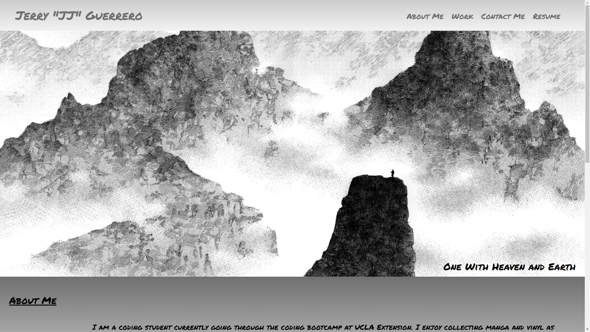
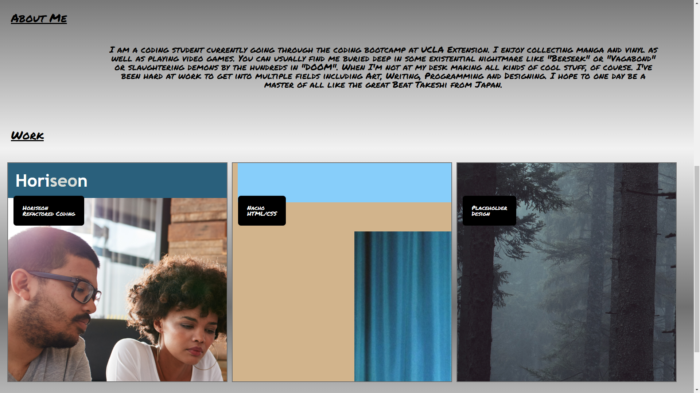
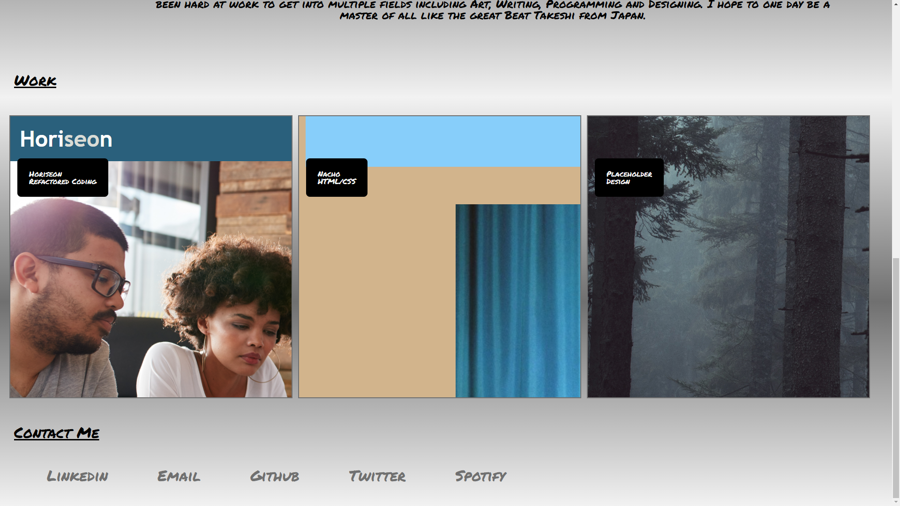

# Designed-Portfolio

## Description
A Portfolio page that I designed to showcase my own skills and applications. I coded the entire HTML and CSS myself as well debugging/optimzing the code. This page will be updated periodically as my applications and skillset grows. Be sure to check back every once in a while to see what I've been making and how I've changed the page!

## One with Heaven and Earth
I thought I'd explain the phrase I added to the hero image. This phrase is from the japanese manga "Vagabond". The main character Musashi says this line in reference to his sword. He says that his sword will become one with heaven and earth. This means he will allow himself to let all of nature act as his weapon, not just the sword he holds between his hands. It speaks to a connection to his surroundings and his ability to see things from a higher perspective. I try to use this mindset when approaching my work. I will be one with heaven and earth. I will allow not only my own hands and work to be my sword, but I will allow everything surrounding me to act as my sword. The people cheering for me to succeed, the people stealing my work or copying instead of working on their own work, the rain that falls down outside my window, the sun coming in through the blinds in the morning. All of this will become my sword and with it I will succeed.

## Design Theme
I wanted everything to fit around the image I used as the hero image. This is an image from "Vagabond" the manga I mentioned previously. The small looking person in the image is Musashi, the main character. This image is meant to be a metaphor for the various levels of strength that other people possess with each mountain signifying a persons strength. You can see the mountain that Musashi is on isn't anywhere near the highest peak, this is a reference to how much he has to grow still. I tried to approach the design for the rest of the page with that image in mind. The font fits the font used in the manga and give the whole page a handwritten/script feel. Various elements throughout the page seem to float and shift giving it a feeling akin to seeing Musashi on the mountain top. The various uses of red throughout are a stark change, much like Musashi's journey is full of stark changes full of violence and blood. I will add more to this page and improve it to fit the vision I have even more as my skillset grows.

## Links

[The Github Repository](https://github.com/JGuerrero126/Designed-Portfolio)

[The Website](https://jguerrero126.github.io/Designed-Portfolio/)

## Screenshots 

